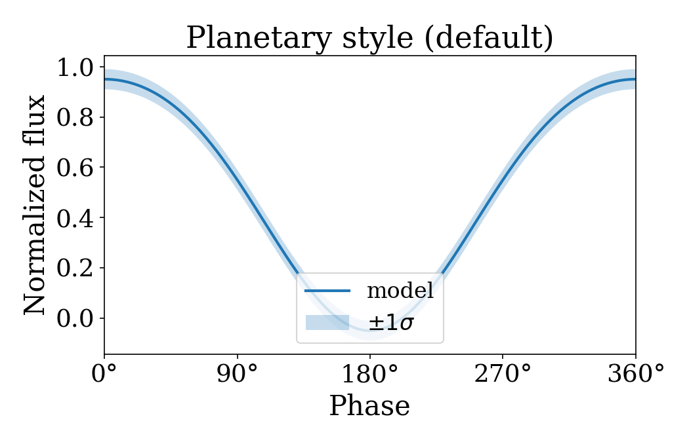
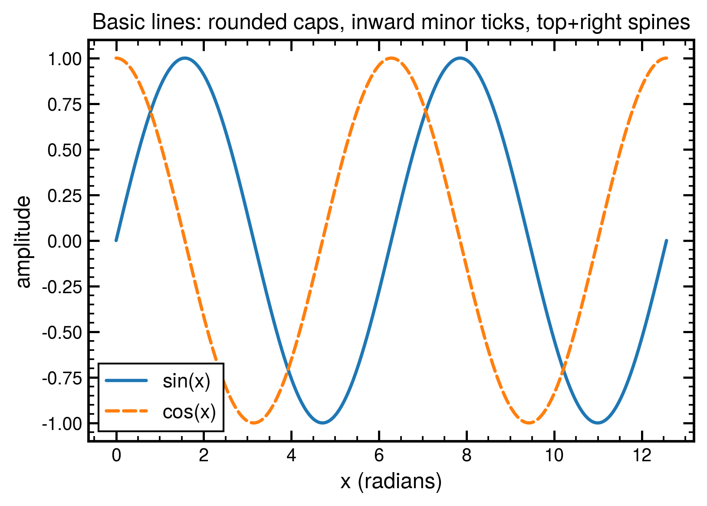
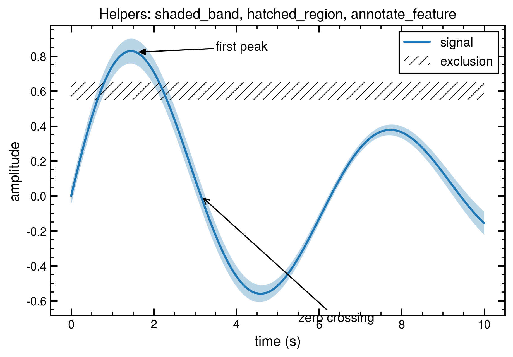
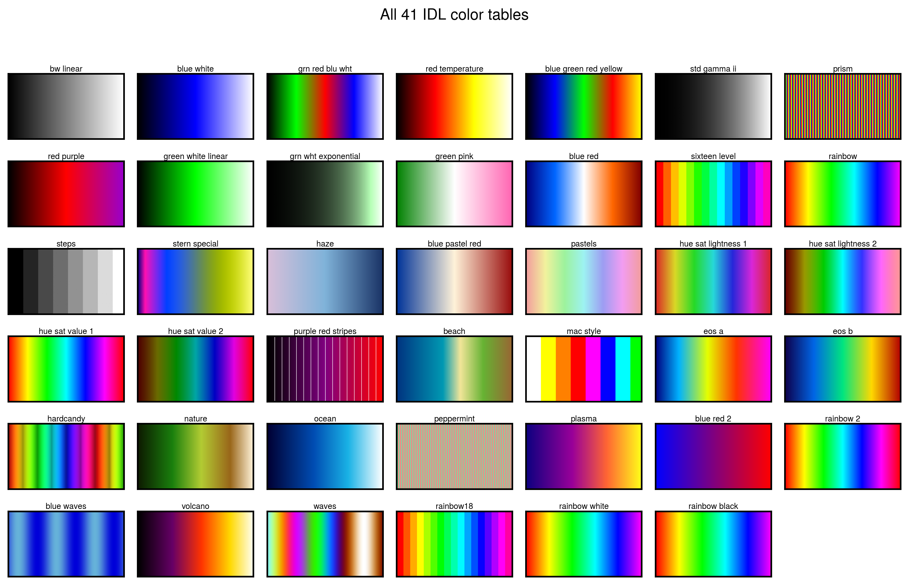
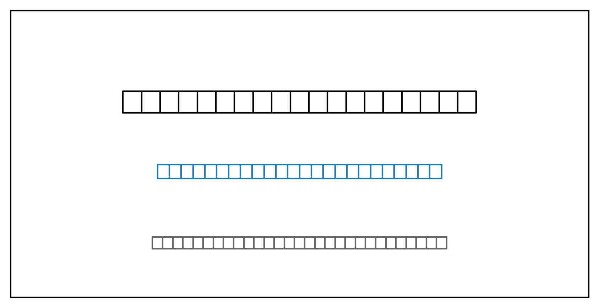

# pretty_plots

Publication-quality matplotlib styles, organized as **families**. Each
family is a coherent set of rcParams (and where useful: helpers, fonts,
colormaps, stroke fonts). The default family is `planetary`; an `idl`
family ships alongside it with per-journal variants and the full IDL
color-table / Hershey-font heritage. New families slot in as siblings
— see [`pretty_plots_spec.md`](pretty_plots_spec.md) for the contract.

| `planetary` (default) | `idl` |
|---|---|
|  |  |

```sh
pip install git+https://github.com/phayne/pretty-plots.git
```

```python
import pretty_plots
import matplotlib.pyplot as plt
import numpy as np

pretty_plots.use()                          # apply the default (planetary)
fig, ax = pretty_plots.subplots(figsize=(7, 4.5))
x = np.linspace(0, 4 * np.pi, 200)
ax.plot(x, np.sin(x))
plt.show()
```

## Contents

- [Style families](#style-families)
- [Working with families](#working-with-families)
- [The `planetary` family](#the-planetary-family)
- [The `idl` family](#the-idl-family)
  - [IDL variants](#idl-variants)
  - [IDL helpers](#idl-helpers)
  - [IDL color tables](#idl-color-tables)
  - [Hershey vector text](#hershey-vector-text)
  - [Fonts](#fonts)
  - [Publication checklist](#publication-checklist)
- [Development](#development)
- [License & credits](#license--credits)

## Style families

| Family    | Aesthetic                                                                                              | Apply with                                                       |
|-----------|--------------------------------------------------------------------------------------------------------|------------------------------------------------------------------|
| `planetary` (default) | Serif body text, larger sizes (16/18/20/22 pt), thicker lines and bigger markers — slides, posters, full-page figures. | `pretty_plots.use()` or `plt.style.use("planetary")`             |
| `idl`     | Helvetica-family sans-serif, inward ticks on all four sides, rounded line caps, embedded TrueType PDFs — IDL-faithful. | `pretty_plots.use(family="idl")` or `plt.style.use("idl")`       |

The top-level `use()` and `context()` accept `family=` and (where the
family has them) `variant=`:

```python
pretty_plots.use()                                  # planetary base
pretty_plots.use(family="idl")                      # IDL base
pretty_plots.use(family="idl", variant="aas")       # IDL + AAS overrides

with pretty_plots.context(family="idl", variant="hershey"):
    ...
```

## Working with families

Each family is also importable directly:

```python
from pretty_plots import idl, planetary

planetary.use()
fig, ax = planetary.subplots()

idl.use()                       # base IDL
idl.use(variant="aas")          # IDL + AAS variant
fig, ax = idl.subplots(figsize=(3.5, 2.6))
idl.save_publication(fig, "out", formats=("pdf", "png"))
```

Inspection:

```python
pretty_plots.families()          # ['planetary', 'idl']
pretty_plots.DEFAULT_FAMILY      # 'planetary'
pretty_plots.__version__         # '0.2.0'
```

`plt.style.use(...)` works on every shipped style name once
`pretty_plots` is imported (directly or transitively):

```python
plt.style.use("planetary")
plt.style.use(["planetary", "planetary-latex"])
plt.style.use("idl")
plt.style.use(["idl", "idl-aas"])
```

## The `planetary` family

A serif-body style derived from the original `planetary.prettyPlots`
module (Hayne, 2017). Larger fonts, thicker lines, bigger markers than
matplotlib's defaults — designed for slides, posters, and full-page
journal figures.

```python
from pretty_plots import planetary
planetary.use()
```

LaTeX rendering is **opt-in** (the original module enabled `usetex` by
default; we moved that to a companion variant so the base imports
cleanly on machines without LaTeX):

```python
plt.style.use(["planetary", "planetary-latex"])     # requires latex on PATH
```

Vectorized degree-symbol tick formatter — emits LaTeX math
(`$45^\circ$`) when `text.usetex=True`, plain Unicode (`45°`)
otherwise:

```python
from pretty_plots.planetary.helpers import degreeLabelFormat

ticks = [0, 90, 180, 270, 360]
ax.set_xticks(ticks, labels=degreeLabelFormat(ticks))
```

## The `idl` family

A drop-in matplotlib style that produces publication-quality plots with
the visual aesthetic of IDL: Helvetica-family sans-serif, inward ticks
on all four sides, rounded line caps, and journal-ready PDF output with
embedded TrueType fonts.

It additionally ships:

- All **41 standard IDL color tables** (`LOADCT 0` through `40`)
  registered as matplotlib colormaps under the `idl_*` prefix.
- A **Hershey vector-font renderer** (`hershey_text`) bundled with the
  seven canonical public-domain JHF files (Roman Simplex/Duplex/Triplex,
  Times-Italic, Script Simplex/Complex, Greek Complex).
- **Per-journal stylesheet variants** for AAS journals, A&A, Nature, and
  Icarus/Elsevier.
- A **`text.usetex=True` variant** (`idl-latex`) that pairs `helvet`
  with `sansmath` for visually consistent LaTeX output.

### IDL variants

Each variant layers tighter font sizes and column-width-appropriate
`figure.figsize` on top of the IDL base style:

| Variant   | Target              | Single-column figsize |
|-----------|---------------------|-----------------------|
| `aas`     | AAS / ApJ / AJ      | 3.5 × 2.6 in          |
| `aa`      | A&A                 | 88 × 65 mm            |
| `nature`  | Nature              | 89 × 67 mm            |
| `icarus`  | Icarus / Elsevier   | 90 × 67 mm            |
| `hershey` | Hershey-aesthetic   | (no figsize override) |
| `latex`   | `text.usetex=True`  | (no figsize override) |

Three equivalent ways to apply:

```python
pretty_plots.use(family="idl", variant="aas")
idl.use(variant="aas")
plt.style.use(["idl", "idl-aas"])
```

### IDL helpers

```python
# Labelled arrow ("filled", "open", "double" arrowheads):
idl.annotate_feature(ax, "CO2", xy=(2010, 390), xytext=(1995, 410))

# Hatched region (no fill, no outline, hatch only):
idl.hatched_region(ax, x, y_low, y_high, pattern="///")

# Shaded uncertainty band (no edge):
idl.shaded_band(ax, x, y - sigma, y + sigma, alpha=0.3, color="C0")

# Save once per format with format-appropriate kwargs:
idl.save_publication(fig, "figure", formats=("pdf", "png"))
```



### IDL color tables

All 41 IDL `LOADCT` tables are registered (forward + reverse):

```python
ax.imshow(data, cmap="idl_rainbow")
ax.imshow(data, cmap="idl_red_temperature_r")
```

Names follow IDL's table 0–40 (snake_cased). See
`pretty_plots.idl.colortables._names.IDL_COLOR_TABLES` for the full list.



### Hershey vector text

```python
from pretty_plots.idl.hershey import hershey_text, available_typefaces

hershey_text(ax, 0.5, 0.5, "HELLO", typeface="roman_simplex", size=14)
print(available_typefaces())
# ['builtin', 'greek_complex', 'italic_complex', 'roman_duplex',
#  'roman_simplex', 'roman_triplex', 'script_complex', 'script_simplex']
```

The seven authentic public-domain Hershey JHF files ship with the
package (see `src/pretty_plots/idl/hershey/data/PROVENANCE.txt`). The
`builtin` typeface is a hand-authored ASCII fallback that always works,
even if the JHF data is unavailable.



### Fonts

The IDL family targets **TeX Gyre Heros** as the primary sans-serif —
the freely-licensed Helvetica clone descended from URW Nimbus Sans.
Three acquisition paths in order of preference:

1. **Bundled** (default): the four OTFs ship with the package and are
   auto-registered with matplotlib's font manager at import time.
2. **System install:** ships in `texlive-fonts-recommended`
   (Debian/Ubuntu), `texlive-fontsextra` (Fedora), and MacTeX.
3. **Direct download** from the GUST e-foundry (OFL-licensed):
   <https://www.gust.org.pl/projects/e-foundry/tex-gyre/heros>.

If neither a bundled nor system-installed copy is present, the style
falls back through `Nimbus Sans → Helvetica → Liberation Sans → Arial →
DejaVu Sans`.

### Publication checklist

- ✅ PDF output uses `pdf.fonttype=42` (Type42/CIDType0 — TrueType,
  suitable for AAS, A&A, Icarus, Nature preflight).
- ✅ `axes.unicode_minus=False` — ASCII hyphen, matching IDL's
  PostScript.
- ✅ `lines.solid_capstyle='round'` — the IDL look.
- ✅ Math text uses the same family as body text (custom
  `mathtext.fontset`).

## Development

```sh
git clone https://github.com/phayne/pretty-plots.git
cd pretty-plots
pip install -e ".[test]"
pytest
```

Regenerate a family's base `.mplstyle` from its `_params.RCPARAMS`:

```sh
python tools/regenerate_mplstyle.py                # both families
python tools/regenerate_mplstyle.py --family idl
python tools/regenerate_mplstyle.py --family planetary
```

End-to-end demo of every IDL surface (regenerates
`examples/output/*.{pdf,png}`):

```sh
python examples/worked_example.py
```

For the architecture, the family contract, and the contributor
checklist for adding a new family, see
[`pretty_plots_spec.md`](pretty_plots_spec.md).

## License & credits

MIT (see [`LICENSE`](LICENSE)). Bundled assets carry their own
licenses, documented in the per-directory `PROVENANCE.txt` files:

- TeX Gyre Heros OTFs in `src/pretty_plots/idl/fonts/` — GUST/OFL.
- Hershey JHF files in `src/pretty_plots/idl/hershey/data/` —
  public domain (Wolcott & Hilsenrath, NBS SP 424, 1976; James Hurt's
  JHF distribution).

The `planetary` family is derived from the `planetary.prettyPlots`
module by **Paul O. Hayne** (Hayne, 2017), with the LaTeX dependency
moved to a companion variant so the base style imports cleanly without
a system LaTeX install.
